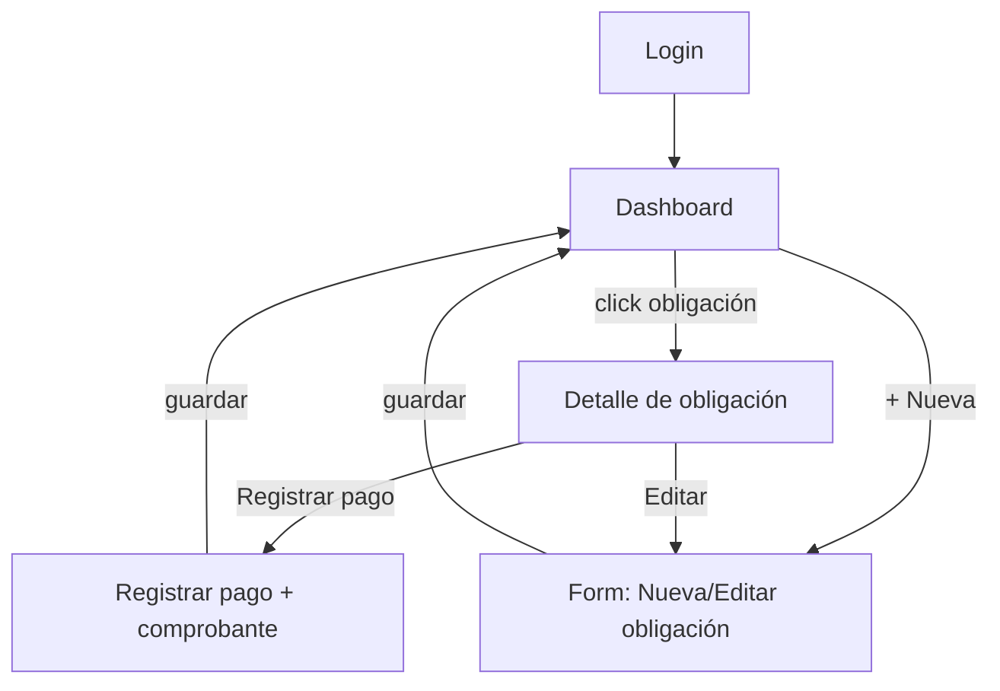

# Flujo de pantallas — MVP

## Mapa de navegación

## Pantallas

### 1. Login
- Supabase Auth: email/password o magic link (2 usuarios fijos, sin registro público).
- Sin recuperación de contraseña compleja para MVP (son 2 personas conocidas).

### 2. Dashboard (home)
- **Consolidado de pareja**: total pendiente/vencido del hogar este mes, siempre visible arriba.
- **Vista propia + toggle**: cada quien ve primero sus propias obligaciones al entrar; un tab/switch permite ver las del otro (mejor para mobile, pantalla angosta).
- Cada obligación se muestra como card/fila con semáforo:
  - 🟢 al día (falta > 5 días)
  - 🟡 próximo a vencer (≤ 5 días, dispara alerta)
  - 🔴 vencido
- Click en una obligación → Detalle.
- Botón flotante/header "+ Nueva obligación" → Form.

### 3. Detalle de obligación (instancia)
- Descripción, monto, categoría, responsable, fecha de vencimiento, estado.
- Si `recurrencia = mensual`: mini historial de instancias pasadas (pagado a tiempo / atrasado).
- Si tiene pago asociado: mostrar comprobante (preview imagen/PDF) y fecha de pago.
- Botones: "Registrar pago" (si pendiente/vencido) · "Editar" (edita la plantilla `obligaciones`).

### 4. Form: Nueva / Editar obligación
- Campos: descripción, monto, categoría (select, con opción "crear nueva"), responsable (Javi / Xime / Compartida), recurrencia (única/mensual), fecha (día de vencimiento si es mensual, fecha exacta si es única).
- Guardar → vuelve al Dashboard.

### 5. Registrar pago
- Input de archivo (imagen o PDF) para el comprobante.
- Fecha de pago (default: hoy), monto pagado (default: monto de la instancia, editable).
- Guardar → marca la instancia como `pagado`, crea fila en `pagos`, vuelve al Dashboard.

## Fuera del MVP v1 (fase 2)
- Pantalla de gestión de categorías (v1 usa las seed + creación inline desde el Form).
- Resumen mensual generado con IA.
- Agente conversacional / MCP.
- Configuración de preferencias de notificación (v1 = alerta por email fija a los 2, sin opción de apagarla).
